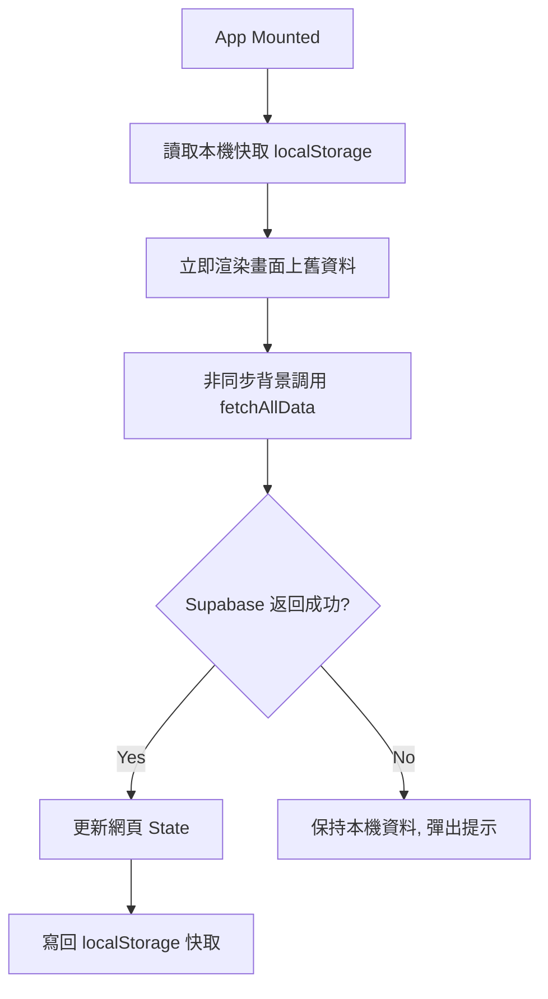
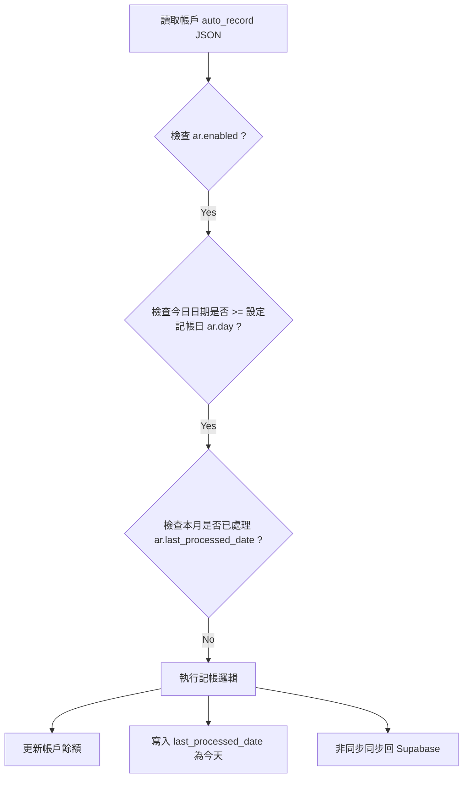

# AI Developer Technical Context Guide (AI 專屬開發與架構說明書)

本文件是為後續接手的 AI 編碼助理（如 Gemini, Claude, GPT）準備的專屬架構說明書，旨在詳細解構本系統的**檔案角色、API 呼叫與運行機制、資料流與快取設計、核心演算法、以及自動記帳引擎**，以實現 100% 精準開發，避免產生 Regression。

---

## 📁 檔案架構與運作角色 (File Roles)

本專案是一個基於 **Vue 3 (Composition API)** 與 **Vite** 的單頁應用程式 (SPA)。

### 1. 作用中檔案 (Active Files)
* **[src/components/Dashboard.vue](file:///e:/code/accounting_app/src/components/Dashboard.vue)**: 承載 **100% 的主畫面與前端邏輯**。包括：
  * **所有響應式狀態 (State)**：帳戶、持倉、匯率、過濾條件等。
  * **所有 Supabase CRUD 操作**：讀取、寫入、刪除帳戶與持倉。
  * **圖表計算與配置**：使用 `vue-chartjs` 繪製淨資產趨勢圖、ROI 折線圖、收支條形圖。
  * **定期定額與自動記帳模擬引擎**。
* **[src/components/BottomNav.vue](file:///e:/code/accounting_app/src/components/BottomNav.vue)**: 底部導覽按鈕列，切換 `list` (帳戶與持倉)、`trend` (淨資產/ROI 趨勢)、`settings` (設定) 三大頁面。
* **[api/yahoo-proxy.js](file:///e:/code/accounting_app/api/yahoo-proxy.js)**: 託管於 Vercel Serverless Function 的 CORS 代理伺服器。前端向其發送請求，它在後端代為抓取 Yahoo Finance 的報價並返回，解決瀏覽器的 CORS 限制問題。
* **[src/lib/supabaseClient.js](file:///e:/code/accounting_app/src/lib/supabaseClient.js)**: 讀取環境變數 `VITE_SUPABASE_URL` 與 `VITE_SUPABASE_ANON_KEY` 並初始化 Supabase Client。
* **[supabase_setup.sql](file:///e:/code/accounting_app/supabase_setup.sql)**: Supabase 資料庫統一初始化 SQL。

### 2. 非作用中檔案 (⚠️ Inactive/Legacy Files - 請勿修改)
* 以下檔案是早期開發留下的獨立備份或測試元件，**目前完全沒有被 App 載入，請忽略且不要修改它們**：
  * `Assets.vue`, `Investments.vue`, `Transactions.vue`, `QuickAdd.vue`, `ExpenseList.vue`, `Subscriptions.vue`, `ExpenseForm.vue`, `ExpenseEditModal.vue`, `ToastNotification.vue`, `FloatingActionButton.vue`

---

## 🌐 API 運作機制與 CORS 代理流 (Yahoo Finance API Proxy)

系統的股價與匯率皆依賴 Yahoo Finance，並通過多層 Proxy 確保高可用度。

### 1. Vercel Serverless Proxy (`api/yahoo-proxy.js`)
此 Proxy 支援兩種模式：
* **批次獲取模式 (Batch Mode)**:
  * **請求**：`GET /api/yahoo-proxy?symbols=AAPL,2330.TW,BTC-USD`
  * **底層 URL**：`https://query1.finance.yahoo.com/v7/finance/quote?symbols=AAPL,2330.TW,BTC-USD&fields=regularMarketPrice,currency,shortName`
  * **回傳**：`{ prices: { "AAPL": 180.2, "2330.TW": 940, "BTC-USD": 65000 } }`
  * **用途**：在頁面載入或手動重新整理時，批次更新所有持倉標的的最新價格。
* **單一歷史曲線模式 (Single Mode)**:
  * **請求**：`GET /api/yahoo-proxy?symbol=AAPL&range=6mo`
  * **底層 URL**：`https://query1.finance.yahoo.com/v8/finance/chart/AAPL?interval=1d&range=6mo`
  * **回傳**：Yahoo Finance Chart 的原始 JSON，包含時間戳 (timestamps) 和收盤價 (close prices)。
  * **用途**：繪製單一股票的歷史走勢圖。

### 2. 前端 CORS 代理 Fallback 鏈 (Fallback Flow)
當 Vercel Serverless Function 回傳失敗或超時，前端在獲取價格或歷史走勢時，會**依序嘗試**以下 Proxy，直到成功為止：
1. 本地開發代理 / Vercel Proxy：`/api/yahoo-proxy?symbol=...`
2. `https://corsproxy.io/?[Yahoo_Finance_URL]`
3. `https://api.codetabs.com/v1/proxy?quest=[Yahoo_Finance_URL]`

---

## 💾 資料流與快取機制 (Stale-While-Revalidate)

為了保證秒開體驗與離線可用性，系統實現了 SWR 快取：



### ⚠️ Supabase 寫入防搶寫安全網 (Race Condition Safety Net)
* **問題**：使用者在前端新增「自訂群組」後，Supabase 寫入是異步的。若使用者在此時重新整理頁面，`fetchAllData()` 從 Supabase 拉取的最新資料可能還不包含該次新增（Supabase 還在處理中），導致群組標記遺失。
* **解決機制**：
  * 在 `fetchAllData()` 中，拉取到持倉與帳戶資料後，會比對本機緩存的群組對照表 `localInvMap`。
  * 若資料庫返回的 `custom_group` 是空字串，但本機 `localInvMap` 存在記錄，則**自動 merge 合併回 State 中**，確保群組關係不會因為網路延遲而遺失。

---

## 📈 核心計算演算法 (Core Calculation Algorithms)

### 1. ROI 折線圖 (Historical ROI Chart) 計算規則
* **LOCF (Last Observation Carried Forward) 填補法**：
  * 由於美股、台股、加密貨幣的開休市時間不一致。如果在特定日期 $T$，美股有收盤價但台股休市，若直接跳過台股，會導致總市值在當天驟降（視同台股成本為0或市值為0）。
  * 系統必須在日期陣列中迭代，若某標的在 $T$ 日無報價，**必須向前尋找該標的最近一次的已知收盤價作為當天報價**。
* **買入日限制 (Pre-Purchase Exclusion)**：
  * 在計算歷史 ROI 曲線時，某筆投資 lot 只能從其 `buy_date` 起開始對總成本和總市值做出貢獻。
  * **嚴禁**將今天的持股成本直接回溯套用在 `buy_date` 之前的歷史報價上，這會造成「尚未買入前成本高昂、市值為0，導致歷史 ROI 暴跌至 -50% 甚至更低」的邏輯 Bug。
* **起點空白裁切 (Trim Empty Space)**：
  * 歷史 ROI 曲線的起點，必須是「所有持倉中，最早的一筆 `buy_date`」的日期，將其之前的無交易空白期全部裁切掉，使圖表聚焦於有交易的歷史段落。

---

## 🔄 定期定額與自動記帳引擎 (DCA & Auto-Record Engine)

自動記帳並非後端 Cron Job，而是**前端模擬引擎**。它在每次呼叫 `processAutoRecords()` 時執行：



### 1. 支援的自動記帳類型 (`type`)
* **`income` (固定收入)**: 帳戶餘額增加指定金額。
* **`expense` (固定支出)**: 帳戶餘額減少指定金額。
* **`transfer` (固定轉帳)**:
  * 轉出帳戶餘額減少指定金額，目標帳戶餘額增加指定金額。
  * **特殊還款邏輯**：若目標帳戶是負債類型（如 `Credit Card`、`Liability` 等），則轉帳視同「還款」，會**減少**目標帳戶的負債餘額。
  * **利息還款計算**：若設定了 `interest_rate` (年利率)，會先算當月利息 `monthlyInterest = 負債餘額 * (年利率 / 100) / 12`，扣除利息後剩下的餘額才用於償還本金。
* **`dca_invest` (定期定額買股)**:
  * **例假日順延**：若記帳日遇到週末（週六或週日），**本次不執行**，順延到週一才扣款買入。
  * **自動報價與換算**：自動向 Yahoo Finance Proxy 查詢該股票最新股價。如果是美股，且扣款帳戶是台幣帳戶，會自動乘以 `usdTwdRate` 進行餘額扣除，並換算出精準到小數點後 6 位的股數 `quantity`，隨後在 `investments` 表中**新增一筆買入持倉記錄 (lot)**。

---

## 🗄️ 資料庫 Schema 關係 (Database Schemas)

### 1. `accounts` (帳戶與自動記帳)
| 欄位名稱 | 型態 | 說明 |
| :--- | :--- | :--- |
| `id` | uuid | 主鍵 (UUID) |
| `name` | text | 帳戶名稱 (例如：台新 Richart) |
| `balance` | numeric | 帳戶餘額 |
| `type` | text | 帳戶類型 (Bank, Cash, Credit Card, Liability 等) |
| `custom_group`| text | 自訂分組名稱 (例如：台幣、美金) |
| `auto_record` | jsonb | **儲存自動記帳設定的 JSONB 陣列** (結構見下方說明) |

#### `auto_record` JSON 結構範例：
```json
[
  {
    "id": "rec-12345",
    "day": 10,
    "type": "transfer",
    "amount": 20000,
    "enabled": true,
    "expiry": "none",
    "target_account_id": "target-uuid-xxxx",
    "interest_rate": 2.1,
    "last_processed_date": "2026-06-10T00:00:00.000Z"
  }
]
```

### 2. `investments` (投資持倉明細 - Lot 模式)
每一筆買入紀錄都會成為一個獨立的 lot，便於精確追蹤買入日期的 ROI。
| 欄位名稱 | 型態 | 說明 |
| :--- | :--- | :--- |
| `id` | uuid | 主鍵 (UUID) |
| `symbol` | text | 股票/加密貨幣代號 (例如：2330.TW, TSLA, BTC-USD) |
| `name` | text | 標的名稱 |
| `type` | text | 'Stock' 或 'Crypto' |
| `asset_class` | text | 'tw_stock', 'us_stock', 'crypto' |
| `quantity` | numeric | 持有股數/單位數 |
| `average_cost` | numeric | 平均成本 (買入時價格，與 `buy_price` 相同) |
| `buy_price` | numeric | 買入價格 (核心 ROI 計算依據) |
| `buy_date` | date | 買入日期 (歷史 ROI 排除此日期前計算之依據) |
| `current_price`| numeric | 最新市場價格 |
| `currency` | text | 'TWD' 或 'USD' |
| `custom_group` | text | 自訂群組分類 (例如：美股、台股、高股息) |
| `funding_account_id` | text | 連動扣款的 `accounts.id` (可為空) |

### 3. `net_worth_history` (每日資產淨值歷史)
| 欄位名稱 | 型態 | 說明 |
| :--- | :--- | :--- |
| `id` | uuid | 主鍵 (UUID) |
| `date` | date | 快照日期 (Unique) |
| `amount` | numeric | 當日淨資產總計 (資產 - 負債) |

---

## 🛠️ 開發指導方針 (AI Guidelines)

1. **局部編輯為王**：由於 `Dashboard.vue` 超過 7,200 行，請使用 search-and-replace 等局部程式碼塊編輯工具進行修改，不要整份重寫，以避免 Token 超限和標籤閉合損毀。
2. **UTF-8 儲存格式**：因為程式碼中有大量的 emoji 圖示（如 📈, 🏦, ⚙️），修改 any 檔案後**務必確保以 UTF-8 (無 BOM) 編碼格式儲存**，避免字元損毀。
3. **保留 merge 快取邏輯**：當修改任何資料同步或狀態讀取函數時，確保 `localStorage` 的 merge 邏輯（尤其是 `custom_group` 的保護）維持完整。
